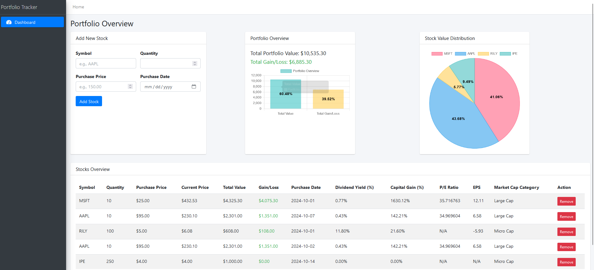

# Portfolio Management App

This Portfolio Management App is a web-based solution built with Flask for tracking and analyzing a stock portfolio. It allows users to manage stock holdings, view real-time stock data, and track metrics such as dividend yield, gain/loss, and capital gain percentage. Additionally, the app fetches and displays important financial metrics like P/E ratio, EPS, and market capitalization categories.



## Features

- **Add Stocks**: Add stock information, including purchase price, quantity, and purchase date.
- **Update Portfolio**: Automatically fetches and updates stock data, including:
  - Current Price
  - Dividend Yield
  - Total Gain/Loss
  - Capital Gain Percentage
  - P/E Ratio
  - EPS
  - Market Capitalization Category (Large, Mid, Small, or Micro Cap)
- **Remove Stocks**: Easily remove stocks from the portfolio.
- **Portfolio Overview**: View a summary of total portfolio value and overall gain/loss.

## Getting Started

### Prerequisites

Ensure you have the following installed:

- Python 3.7+
- [pip](https://pip.pypa.io/en/stable/installation/)

### Installation

1. **Clone the repository:**

    ```bash
    git clone https://github.com/your-username/portfolio-management-app.git
    cd portfolio-management-app
    ```

2. **Install required packages:**

    ```bash
    pip install -r requirements.txt
    ```

3. **Directory Structure:**

    Ensure you have a `data` directory where portfolio data will be stored as `portfolio.json`.

4. **Run the Application:**

    ```bash
    python app.py
    ```

5. **Access the App:**

   Open your browser and navigate to `http://127.0.0.1:5000/` to access the app.

### Folder Structure
```
portfolio-management-app/ 
|
├──| static/ 
│  ├──| 
│  │  └── datatables.css  # DataTables styling 
|  |  └── styles.css
|  | 
│  └──| js/
|     └──|
│        └── datatables.js # DataTables initialization 
│        └── portfolio_chart.js
│        └── script.js
|
├──| templates/ 
│  └──| 
|     ├── index.html  # HTML template for the main page
|     ├── base.html
|     | 
|     | components/
|     └──| 
|        ├── add_stock_form.html
│        └── footer.html
|        └── navbar.html
|        └── portfolio_overview_chart.html
|        └── sidebar.html
|        └── stock_value_distribution_chart.html
|        └── stocks_overview_table.html 
|
├──| data/
|  └──|  
│     └── portfolio.json # Stores portfolio data in JSON format 
|
├── app.py # Main Flask application 
|
└── requirements.txt # Package dependencies
```


## Usage

1. **Home Page**:
   - Displays the stock portfolio, including each stock's symbol, quantity, purchase price, current price, gain/loss, and metrics like P/E ratio and EPS.

2. **Add Stock**:
   - Enter a stock's symbol, purchase price, quantity, and purchase date to add it to your portfolio.
   - The app will fetch the stock's current price, dividend yield, and other metrics.

3. **Remove Stock**:
   - Use the "Remove" button to delete a stock from your portfolio.

4. **View Metrics**:
   - Track your portfolio's **Total Value**, **Total Gain/Loss**, **Dividend Yield**, **Capital Gain Percentage**, and other critical metrics.

## Technologies Used

- **Flask** - Backend framework for routing and managing portfolio data.
- **Yahoo Finance (yfinance)** - To retrieve live stock data, including prices and financial metrics.
- **DataTables** - For enhanced table display with pagination, search, and sort features.
- **HTML, CSS, JavaScript** - Frontend styling and structure.

## Notes

- Ensure a stable internet connection to fetch real-time data using the `yfinance` API.
- The `portfolio.json` file should have write permissions, as it is the main storage for portfolio data.

## Contributing

1. **Fork the Project**
2. **Create your Feature Branch** (`git checkout -b feature/AmazingFeature`)
3. **Commit your Changes** (`git commit -m 'Add some AmazingFeature'`)
4. **Push to the Branch** (`git push origin feature/AmazingFeature`)
5. **Open a Pull Request**

## License

This project is open-source and free to use, modify, and distribute. Please feel free to contribute!

## Contact us

Please reach out to us if you have any questions or need to build something similar to this at info@avionanalytics.com

---

**Enjoy managing your portfolio with ease!**
